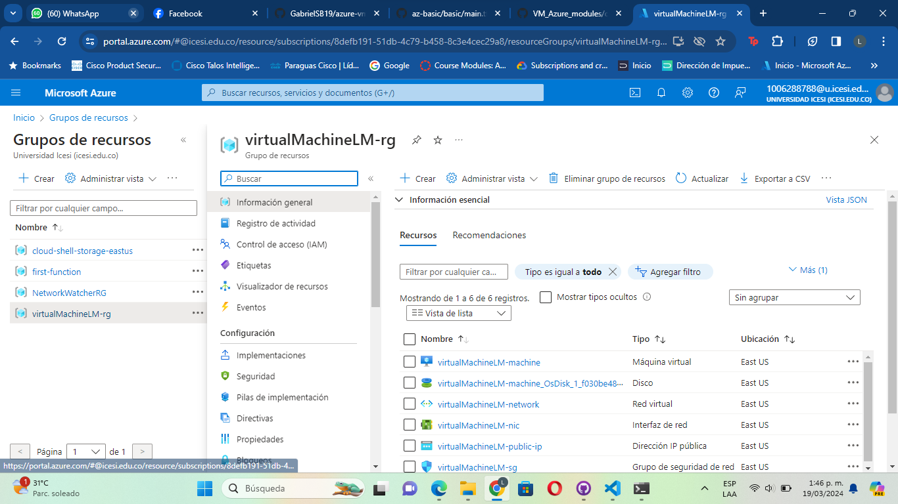

## AzureVM - Modular - Terraform

## Description

This repository contains Terraform files capable of creating an Ubuntu Linux virtual machine. The code is modularized into different folders. Terraform is an open-source tool from HashiCorp that allows defining and provisioning infrastructure as code.

**Prerequisites**

Before getting started, make sure you have Terraform installed.

- Terraform
- Make sure you have:
  - Terraform installed on your local machine.
  - Azure CLI installed and configured with credentials.

**Versioning**

This project is being versioned using GitHub.

- [GitHub](https://github.com/)

**Getting Started**

**Step 1**

You need to create a folder containing the following files:

- `main.tf` (Contains the source code for creating instances in Azure)
- `variables.tf` (Defines the variables we are going to use)
- `terraform.tfvars` (Assign values to the variables created in the `variables.tf` file)
- `outputs.tf` (Defines the output we want to see when creating an instance)
- `providers.tf` (Provider definition file)

Then create a subfolder called `modules`.

Within the `modules` folder, start defining the instances you want to create. Each instance should be a folder.

In each folder created previously, create the `main.tf`, `variables.tf`, `outputs.tf` files.

Once this is done, your file structure should look like this:

**Step 2**

Now, let's define the variables used in this project, this will be done in the `variables.tf` document:

    variable name_function {
        type        = string
        description = "Virtual machine name"
    }

    variable location {
        type        = string
        default     = "East US"
        description = "Location"
    }

    variable username {
        type        = string
        description = "Username"
    }

**Step 3**

Once the variables are defined, we'll assign values to them in the terraform.tfvars file:

name_function = "virtualMachineLM"
location      = "East US"
username      = "luis486"

**Step 4**

We define the provider in our providers.tf file:

    terraform {
    required_version = ">=1.0"
    required_providers {
        azurerm = {
        source  = "hashicorp/azurerm"
        version = "~>3.0"
        }
        random = {
        source  = "hashicorp/random"
        version = "~>3.0"
        }
    }
    }

    provider "azurerm" {
    features {}
    }

**Step 5**

We define the Azure instances we'll need to create the Virtual Machine. Here's how our folder containing the virtual machine would look like:

    resource "azurerm_public_ip" "devops_ip" {
        name                = "${var.name_function}-public-ip"
        location            = var.location
        resource_group_name = var.resource_group_name
        allocation_method   = "Static"
    }

    resource "azurerm_network_interface" "devops_nic" {
        name                = "${var.name_function}-nic"
        location            = var.location
        resource_group_name = var.resource_group_name

        ip_configuration {
            name                          = "internal"
            subnet_id                     = var.subnet_id
            private_ip_address_allocation = "Dynamic"
            public_ip_address_id          = azurerm_public_ip.devops_ip.id
        }
    }

    resource "azurerm_network_security_group" "devops_sg" {
        name                = "${var.name_function}-sg"
        location            = var.location
        resource_group_name = var.resource_group_name

        security_rule {
            name                     = "Ssh"
            priority                 = "100"
            direction                = "Inbound"
            access                   = "Allow"
            protocol                 = "Tcp"
            source_port_range        = "*"
            destination_port_range   = "22"
            source_address_prefix    = "*"
            destination_address_prefix = "*"
        }

        security_rule {
            name                     = "PING"
            priority                 = "1000"
            direction                = "Inbound"
            access                   = "Allow"
            protocol                 = "Icmp"
            source_port_range        = "*"
            destination_port_range   = "*"
            source_address_prefix    = "*"
            destination_address_prefix = "*"
        }

        tags = {
            environment = "Production"
        }
    }

    resource "azurerm_network_interface_security_group_association" "devops_association" {
        network_interface_id      = azurerm_network_interface.devops_nic.id
        network_security_group_id = azurerm_network_security_group.devops_sg.id
    }

    resource "azurerm_linux_virtual_machine" "vm_devops" {
        name                  = "${var.name_function}-machine"
        resource_group_name   = var.resource_group_name
        location              = var.location
        size                  = "Standard_F2"
        admin_username        = var.user
        network_interface_ids = [azurerm_network_interface.devops_nic.id]

        admin_ssh_key {
            username   = var.user
            public_key = file("C:/Users/semillero/id_rsa.pub")
        }

        os_disk {
            caching              = "ReadWrite"
            storage_account_type = "Standard_LRS"
        }

        source_image_reference {
            publisher = "Canonical"
            offer     = "0001-com-ubuntu-server-focal"
            sku       = "20_04-lts"
            version   = "latest"
        }
    }

The respective variables.tf file would be:

    variable "resource_group_name" {
        type        = string
        description = "grupo de recursos de las vm"
    }

    variable "location" {
        type        = string
        description = "region"
    }

    variable "subnet_id" {
        type        = string
        description = "id de la subnet de los servidores"
    }

    variable "user" {
        type        = string
        description = "usuario ssh"
    }

    variable "name_function" {
        type        = string
        description = "prefijo de los recursos"
    }

Now, let's create our main.tf where we'll call the modules:

    resource "azurerm_resource_group" "main" {
        name     = "${var.name_function}-rg"
        location = var.location
    }

    resource "azurerm_virtual_network" "main" {
        name                = "${var.name_function}-network"
        location            = var

### Terraform Commands

Initialize Terraform: Run the following command to initialize Terraform and download the required providers.

*terraform init*

Review and Customize Configuration: Open the main.tf file in a text editor and review the configuration. Customize the settings as needed, such as VM size, region, username, password, etc.

Plan the Deployment: Run the following command to create an execution plan. This step will show you what Terraform will do when you apply the configuration.

*terraform plan*

Ensure the correct format: If you make changes, ensure that have correct identantion

*terraform fmt*

Deploy the Virtual Machine: If the plan looks good, apply the configuration to deploy the virtual machine.

*terraform apply*

## EVIDENCIAS

**Terraform Init**

**Terraform Plan**

**Terraform Apply**

**Terraform Destroy**

**Visualización en Azure**

